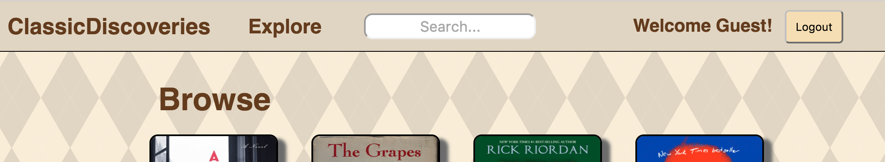
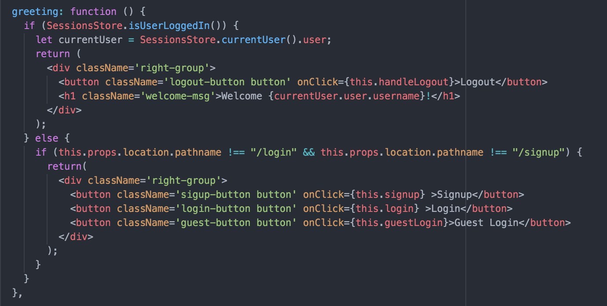
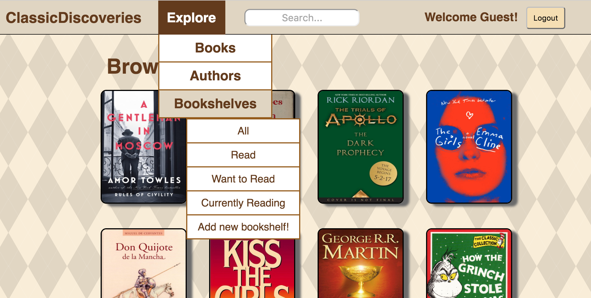
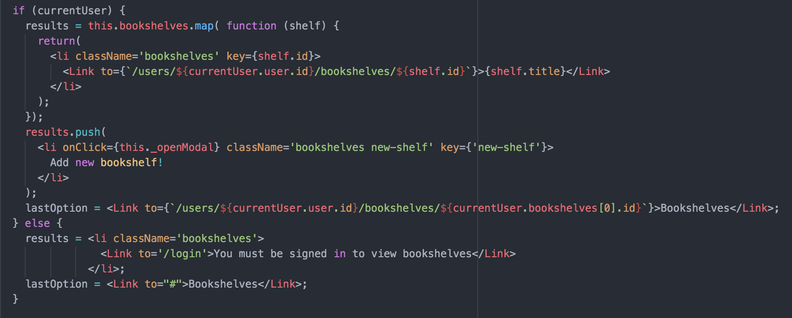
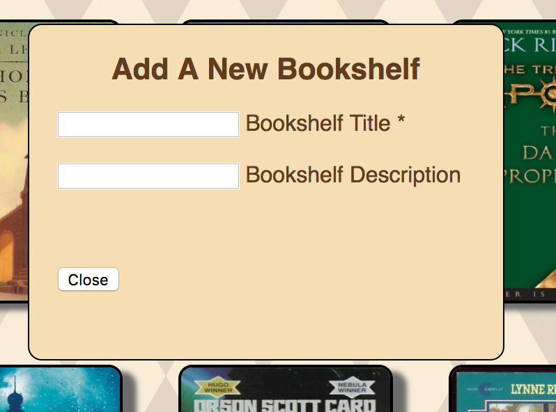
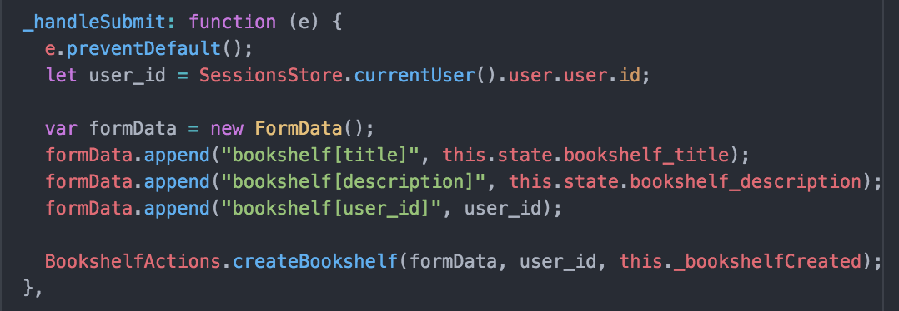

# ClassicDiscoveries

ClassicDiscoveries is an online literary library where users can find their next favorite book or rediscover an old classic. With inspiration from GoodReads, this single page web application improves the user's experience by eliminating whitespace and allowing for a more wide spread browse feature. Once a user finds a book that they love, they can add it to a number of different bookshelves in order to save them for later!

[Live Link][live]
[live]: http://www.classic-discoveries.com

## Technical Details:

ClassicDiscoveries was build using Ruby on Rails for the back-end and React.js/Flux, JavaScript, HTML5, and CSS3 for the front end. This is a single page app that takes care of re-rendering quickly and efficiently with the use of React/Flux. ClassicDiscoveries uses very DRY code by reusing a handful of components across the entire app. Massive loads of data to/from the server are avoided as well by only requesting information that is needed where the user currently is navigating.

## Login Page:

### Greeting Message

The following is how the greeting message is selected (top right of navBar). If there is a current user, the welcome message as well as their username
pops up with a logout button. If there is no current user, then the guest login, login, and logout buttons will appear on every page except the sign in page. There is no need to redirect to the same page.

#### Sample Code

### Dropdown Menu with User's Bookshelves

The Browse dropdown menu has a Bookshelves option. This is toggled between a list of the current user's bookshelves and a Sign In option. This was easy,
but how can you make sure that the current user has all of their bookshelves listed and not just the default ones? I made a call to the bookshelf store
to collect all of the user's bookshelves and listed them with a link in the dropdown.

#### Sample Code

### Creating a new Bookshelf

This method uses a FormData object to collect and send the information given to it. This helps keep all of the information grouped together. This style
is also used when creating a new book.

#### Sample Code

## To-Do:

- [ ] Add book tags
- [ ] Allow users to find/follow friends or fellow readers
- [ ] Implement OmniAuth for ease of signup
