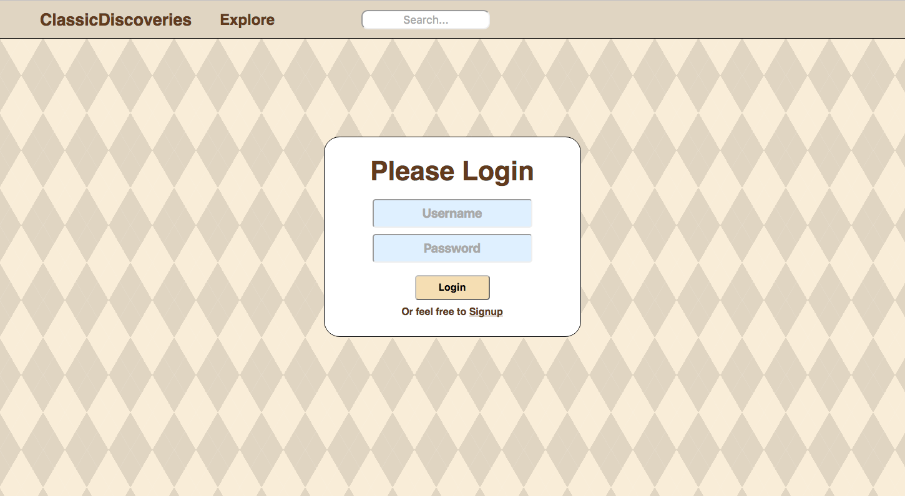
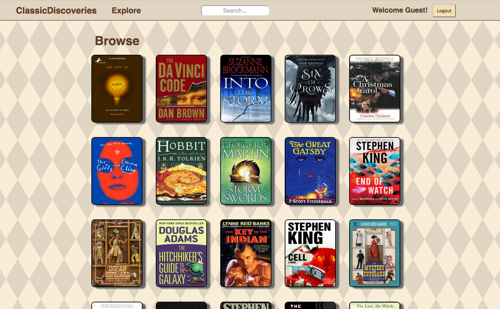

# ClassicDiscoveries

ClassicDiscoveries is an online literary library where users can find their next favorite book or rediscover an old classic. With inspiration from GoodReads, this single page web application improves the user's experience by eliminating whitespace and allowing for a more wide spread browse feature. Once a user finds a book that they love, they can add it to a number of different bookshelves in order to save them for later!

[Live Link][live]
[live]: http://classic-discoveries.com

### Technical Details:

ClassicDiscoveries was build using Ruby on Rails for the back-end and React.js/Flux, JavaScript, HTML5, and CSS3 for the front end. This app runs very smoothly by reusing several components throughout the site and only rendering sections that change. Massive loads of data to/from the server are avoided as well by only requesting information that is needed where the user currently is navigating.

### Login Page:

### Browse:

### To-Do:

- [ ] Add book tags
- [ ] Allow users to find/follow friends or fellow readers
- [ ] Implement OmniAuth for ease of signup
- [ ] Add books to AuthorShow page
